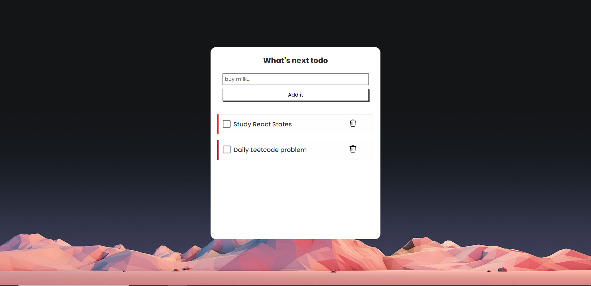

# Todo-WebApp
A simple and intuitive To-Do application built with React. This app allows users to add, check/uncheck, and delete tasks, helping them manage their daily activities efficiently. The app also persists your tasks using localStorage, so your to-do list is saved even if you refresh the page or close your browser.

## Features

- **Add Tasks**: Quickly add new tasks to your to-do list.
- **Toggle Completion**: Mark tasks as complete or incomplete with a checkbox.
- **Delete Tasks**: Remove tasks from your list with a simple click.
- **Random Colors**: Each task is highlighted with a randomly generated box-shadow color.
- **Persistent Storage**: Tasks are saved in `localStorage`, so they remain even after a page reload.
- **Responsive Design**: Optimized for both desktop and mobile use.

## Demo

